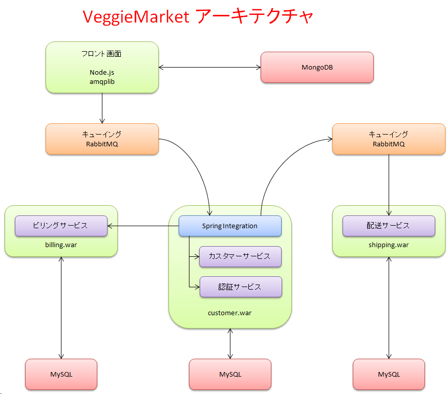
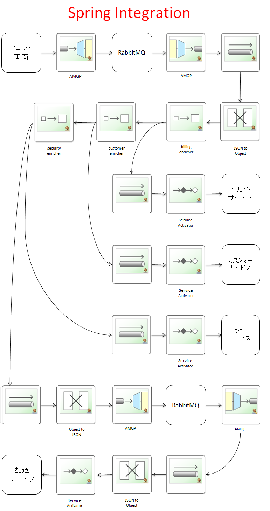

VeggieMarket
============

##### CustomerModel (廃棄済み)
##### ShoppingSite（未定）
* Seleniumテストあり
* 中身が家電なので修正予定

### Customerプロジェクト
* 認証サーバー
* 顧客データベース等のORM(Object Relational Mapper) Hibernate使用
* 単体・結合テストを使ったTDD/XP/Scrum
* Mockito/JUnit4/MockMvc/dbunit + Stub + ContextConfiguration(DIのテストもあり)
* 予定：Spring Batch/Taskの追加を予定

### jsプロジェクト（Node.js）
* Backbone.js / jQuery / underscore
* Node.js+RabbitMQのためのAMQPアダプター
* 元々はBlog系のアプリとして設計・実装したが、フロントエンドとして再設計中
* jasmineによる単体テストあります（まだTDDではないので今後に検討）
* 予定：coffeescript+Sass+Jade+Gruntの追加を予定、技術面では練習作があるので付け加える

### integrationプロジェクト
* EAI/EIP サーバー
* Spring Integrationサーバー

###アーキテクチャ
---

---

